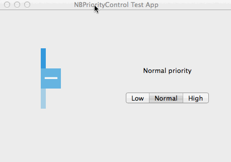

# NBPriorityControl



`NBPriorityControl` is a NSControl for OS X which can be used in todo-list applications. This control contains 3 squares representing priority levels. 

---
## Usage

Import NBPriorityControl.h/m files in your Xcode project and import the header file in your controller :

    #import "NBPriorityControl.h"


The control can be created :

- from nib files using Custom View widget
- programmatically with :

    ```
    NBPriorityControl *priorityControl = [[NBPriorityControl alloc]initWithFrame:rect];
    ```
     
and set action/target :

    priorityControl.target = self;
    priorityControl.action = @selector(changePriority:);

NBPriorityControl can be customized using some properties :

- `backgroundColor`
- `icon`
- `orientation` (NBPriorityControlVertical or NBPriorityControlHorizontal)

---
## Disclaimer
`NBPriorityControl` is simply a reusable code that you can use in your own project for any purpose as outlined in the LICENSE file. It's just a NSControl subclass.

---
## License
`NBPriorityControl` is available under the MIT license. See the LICENSE file for more info.

[1]:	NBPriorityControlScreenshot.gif
